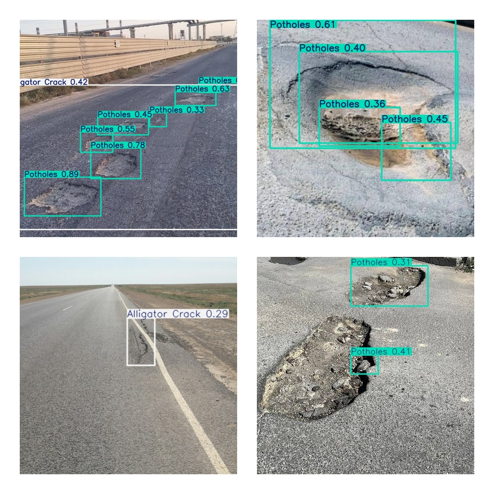

# Road Damage Detection Applications

This project is road damage detection applications that designed to enhance road safety and infrastructure maintenance by swiftly identifying and categorizing various forms of road damage, such as potholes and cracks.

## Performing Detection Using Image


## Performing Detection Using Video


The project is powered by YOLOv8 deep learning model that trained on Crowdsensing-based Road Damage Detection Challenge 2022 dataset.

There is four types of damage that this model can detects such as:
- Longitudinal Crack
- Transverse Crack
- Alligator Crack
- Potholes

### Prepare the Dataset

Download the datasets from this [github](https://github.com/sekilab/RoadDamageDetector) and you can extract the *RDD2022.zip* files into this structure.

```
/home/oracl4/project/rdd/dataset/RDD2022/
├── RDD2022_all_countries
│   ├── China_Drone
│   │   └── train
│   │       ├── annotations
│   │       │   └── xmls
│   │       ├── images
│   │       └── labels # Created after prepare dataset process
│   ├── China_MotorBike
│   │   └── ...
│   ├── Czech
│   │   └── ...
│   ├── India
│   │   └── ...
│   ├── Japan
│   │   └── ...
│   ├── Norway
│   │   └── ...
│   └── United_States
│       └── ...
└── rawData # Not Used, .zip folder
```

Perform the dataset conversion from PascalVOC to YOLOv8 format using **0_PrepareDatasetYOLOv8.ipnb** notebook. This will also create a train and val split for the dataset due to lack of test labels on the original dataset. It will also remove excess background image from the dataset. It will copy the dataset and create a new directory on the training folder.

```
├── dataset
│   └── rddJapanIndiaFiltered
│       ├── India
│       │   ├── images
│       │   │   ├── train
│       │   │   └── val
│       │   └── labels
│       │       ├── train
│       │       └── val
│       ├── Japan
│       │   └── ...
│       └── rdd_JapanIndia.yaml # Create this file for YOLO dataset config
└── runs
```

Run the training on **1_TrainingYOLOv8.ipynb** notebook. You can change the hyperparamter and training configuration on that notebook.

## Evaluation Result

This is the training result of the YOLOv8s model that trained on the filtered Aktau dataset with RTX3050 GPU. You can perform the evaluation on your dataset with **2_EvaluationTesting.ipynb** notebook, just convert your dataset into ultralytics format.

<p align="center">
    
    
    
</p>

